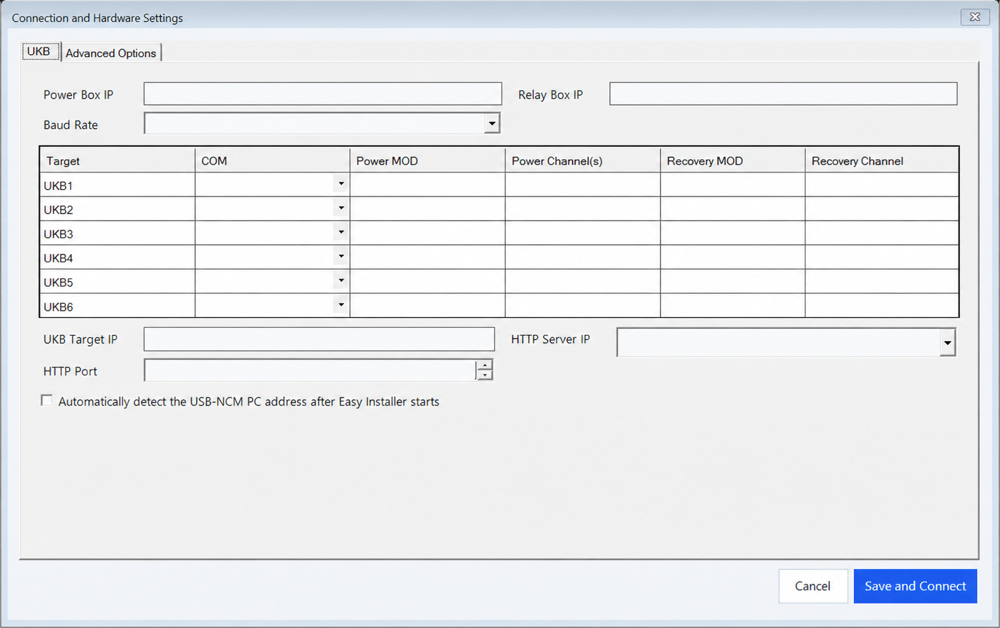

# Flight Control Computer Software Deployment Automation

**A Windows-based field engineering application that automates secure, repeatable, and traceable software deployment to Flight Control Computers (FCCs) used in aircraft Systems Integration Laboratory (SIL) and Hardware-in-the-Loop (HIL) test environments.**

The application coordinates Moxa-based power and recovery control, serial-console supervision, Toradex recovery boot, USB-NCM network preparation, local TEZI package delivery, installation monitoring, reboot sequencing, and post-install Operational Flight Program (OFP) verification in one controlled workflow.

## Why this project matters

Aircraft integration laboratories combine real avionics hardware, power distribution, cable harnesses, sensors, simulated aircraft signals, and software models to validate system behavior before flight. Updating an FCC in such an environment can require several independent tools and manual hardware actions. This project turns that fragmented procedure into a single operator-guided deployment process.

| Capability | Operational value |
|---|---|
| End-to-end workflow orchestration | Executes hardware and software steps in the required order from one interface. |
| Hardware-aware control | Operates only the selected FCC power and recovery channels and verifies each write by reading it back. |
| Multi-target profiles | Stores COM, power, and recovery mappings for FCC1 through FCC6 in a centralized configuration. |
| Validated package deployment | Validates the TEZI package structure before exposing it to the installer. |
| Portable field operation | Adapts to Windows 10/11 systems with different COM and USB-NCM device assignments. |
| Traceable execution | Records timestamped logs and checkpoints for every critical stage. |
| Controlled failure handling | Provides timeouts, retries, operator guidance, cancellation, and safe shutdown behavior. |

> [!IMPORTANT]
> This software directly controls power, recovery state, and target software installation. It must only be used by authorized personnel with a verified FCC target, approved channel mappings, and an approved TEZI package.

## Current release

Stable release: **v1.0.3**

- [Download the field package from GitHub Releases](https://github.com/mdegerr/fcc-software-deployment-automation/releases/tag/v1.0.3)
- [View release notes](RELEASE_NOTES.md)

## Operational context and terminology

- **Flight Control Computer (FCC):** The target airborne computer receiving the approved software package.
- **Aircraft Systems Integration Laboratory (SIL):** The ground-based integration environment containing real avionics, electrical interfaces, harnesses, sensors, simulation systems, and test equipment.
- **Hardware-in-the-Loop (HIL):** The test method in which real FCC hardware interacts with simulated aircraft and sensor behavior in real time.
- **Avionics integration bench/rig:** A smaller test setup focused on a specific avionics subsystem or integration scope.

This repository uses **SIL/HIL** terminology rather than organization-specific laboratory names. “Iron Bird” is intentionally not used as a generic term because it normally refers to a larger physical test rig containing representative aircraft electrical, hydraulic, and flight-control components.

Reference terminology: [NASA Research Aircraft Integration Facility](https://www.nasa.gov/directorates/armd/iasp/fdc/research-aircraft-integration-facility-capabilities/) and [NASA Flight Simulation Facilities](https://www.nasa.gov/setmo/facilities/flight-simulation-facilities/).

## Manual process replaced by the application

A conventional deployment may require an operator to:

1. Copy the approved software package to removable media.
2. Set the FCC power and recovery channels using separate hardware-control software.
3. Launch the recovery procedure and place the FCC in its installer environment.
4. Move the removable media to the FCC.
5. Connect to the installer interface using a remote-viewer application.
6. Select and start the software installation manually.
7. Return recovery to normal, reboot the FCC, and verify the installed OFP version.

The current network-based workflow automates or supervises these operations without requiring the operator to interact with the installer desktop.

## Automated deployment workflow

1. Resolve the selected platform profile and FCC target.
2. Validate the selected TEZI package.
3. Verify Moxa Power Box and Relay Box communication.
4. Place only the selected FCC in the required power and recovery state.
5. Start the Toradex Easy Installer recovery environment through USB/UUU.
6. Detect and configure the USB-NCM network interface.
7. Publish the TEZI package through a session-local HTTP server and DNS-SD/mDNS announcement.
8. Monitor installer requests, package transfer evidence, and target shutdown.
9. Return Recovery to NORMAL and restart the FCC.
10. Verify the expected OFP version and physical Ethernet Link Up evidence.
11. Record the result and cleanup status in the session log.

## Controlled interfaces

| Interface | Application responsibility |
|---|---|
| Moxa Power Box | Reads, writes, and verifies only the selected FCC power channel. |
| Moxa Relay Box | Sets the selected FCC recovery channel to REAL or NORMAL and verifies the result. |
| Serial port | Monitors FCC and Easy Installer output and sends only limited installer-control commands where required. |
| USB/OTG and UUU | Starts the Toradex Easy Installer recovery environment on the target. |
| USB-NCM adapter | Identifies the session adapter and prepares the required IPv4 address and target route. |
| Local HTTP service | Exposes only the validated TEZI staging package during the active installation session. |
| DNS-SD/mDNS | Announces the session-local installer feed. |
| Temporary workspace | Prepares package data in an application-specific temporary directory without modifying the source package. |
| Session logs | Stores operator-visible summaries and detailed checkpoint evidence. |

## Safety boundaries

- Only one FCC is updated at a time.
- The target FCC must be explicitly selected.
- Power and recovery writes are verified through readback.
- Package transfer and target shutdown are evaluated using serial and HTTP evidence.
- The expected OFP version is compared with the version reported after reboot.
- Cancellation and application shutdown attempt to return the selected target to a safe state.
- Real OFP/TEZI packages, field logs, credentials, and machine-specific settings are excluded from the repository.

## Field workstation prerequisites

- Windows 10 or Windows 11.
- Administrator privileges.
- Network access to the configured Moxa devices.
- The correct FCC serial COM port available and not held by another application.
- USB-NCM/OTG drivers installed and functioning.
- A data-capable OTG cable connected directly to the workstation where possible.
- Windows Defender Firewall rules permitting the application’s local HTTP and mDNS traffic.
- A complete, approved TEZI package in the configured version repository.
- Verified COM, baud rate, Moxa IP, slot, and channel mappings.

## Main interface

The main interface selects the platform profile, software version, and target FCC. Version folders are sorted naturally, the newest compatible package is selected by default, and deployment remains disabled until a valid TEZI structure is found.

## FCC connection settings

Each FCC keeps its own COM, Power MOD/channel, and Recovery MOD/channel mapping. Shared Power Box IP, Relay Box IP, and baud-rate settings are managed in the same panel.

## Advanced options

The version repository, platform mappings, and optional TEZI package-prefix validation are managed here. User changes are stored in the application’s `Settings.json` profile.

## Technical architecture

- **Application:** C# / .NET 8 / Windows Forms
- **Distribution:** Self-contained Windows x86 field package
- **Hardware control:** Moxa MXIO API
- **Target communication:** Serial port, USB/UUU, and USB-NCM
- **Package delivery:** Session-local HTTP server
- **Service discovery:** DNS-SD / mDNS
- **Installer environment:** Toradex Easy Installer
- **Reliability controls:** Readback verification, bounded retries, timeouts, cancellation, and safe shutdown
- **Observability:** Detailed session logs and stage-based checkpoints

## Repository layout

| Location | Purpose |
|---|---|
| `Kaynak Kod/SurumYakma_Agdan` | Main solution, application, and automated test project |
| `Kaynak Kod/Shared` | Shared configuration, hardware detection, localization, and UI components |
| `Kaynak Kod/UKB/tezi` | Toradex Easy Installer recovery and UUU runtime tools |
| `.github/readme-assets` | Sanitized screenshots used by this README |
| GitHub Releases | Versioned, ready-to-run Windows x86 field packages |

The `Kaynak Kod` directory name is retained for compatibility with existing build and help-generation tooling; it represents the repository’s source tree.

## Distribution policy

Field users should download the required **Windows x86 ZIP package** from GitHub Releases. Each ZIP contains the runnable application and, where available, the cleaned source tree associated with that release. GitHub’s SHA-256 asset digest can be used to verify download integrity.

The main page documents only the current v1.0.3 release. The USB workflow and v1.0.0–v1.0.2 packages remain available as historical releases.

The application’s `Settings.json` may contain workstation- and platform-specific values. COM, Moxa IP, slot/channel, and USB-NCM settings must be verified whenever the application is moved to another workstation.

## Logging and diagnostics

Every run creates a separate session log under the `logs` directory. Detailed logs include:

- operation start and completion,
- selected profile, version, and FCC,
- Moxa connection and readback results,
- USB/UUU and USB-NCM detection stages,
- HTTP and mDNS activity,
- package-transfer evidence,
- serial-console verification,
- failures, retries, cancellation, and cleanup results.

Each record includes a timestamp and, where applicable, a checkpoint identifier.

## Confidentiality

Do not commit or publish:

- real flight software or OFP/TEZI packages,
- field logs,
- workstation-specific `Settings.json`,
- passwords or device credentials,
- organization-specific network, platform, or hardware mappings.

This repository is intended only for authorized engineering, test, and maintenance activities.