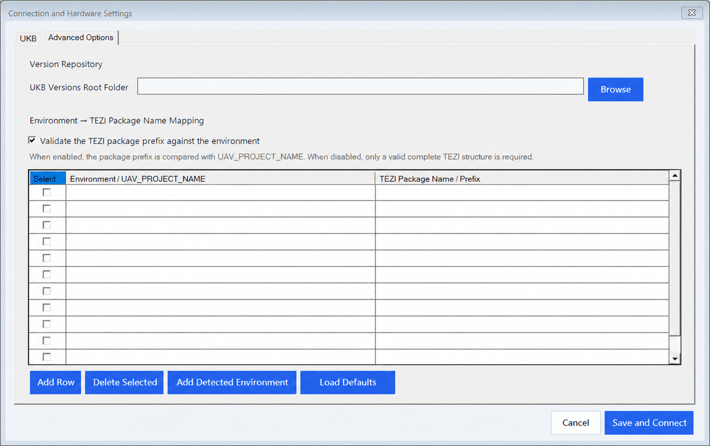

# UKB Software Deployment & Recovery Automation

**UKB uçuş kontrol bilgisayarlarına doğrulanmış TEZI yazılım paketlerini güvenli, tekrarlanabilir ve izlenebilir biçimde dağıtan Windows saha otomasyon platformu.**

Uygulama; Moxa Power/Recovery kontrolünü, seri konsol doğrulamasını, USB-NCM ağ hazırlığını, yerel TEZI paket sunumunu, kurulum takibini ve kurulum sonrası OFP sürüm kontrolünü tek bir denetlenebilir işlem akışında birleştirir.

## Öne çıkan yetkinlikler

| Yetkinlik | Kullanıcıya sağladığı değer |
|---|---|
| Uçtan uca iş akışı | Birden fazla araç ve manuel adımı tek arayüzden, doğru sırayla yönetir. |
| Donanım orkestrasyonu | Seçili UKB’nin Power ve Recovery kanallarını Moxa üzerinden kontrol eder ve geri okuyarak doğrular. |
| Dinamik hedef profilleri | UKB1–UKB6 için COM, güç ve Recovery eşleştirmelerini merkezi yapılandırmada saklar. |
| Güvenli paket dağıtımı | TEZI paket yapısını doğrular, Easy Installer ortamını hazırlar ve yalnızca seçilen hedefe aktarım yapar. |
| Saha taşınabilirliği | Windows 10/11 bilgisayarlarda değişen COM ve USB-NCM koşullarına uyarlanabilen profil tabanlı yapı sunar. |
| Operasyonel izlenebilirlik | Her kritik adımı zaman damgalı loglar ve checkpoint kayıtlarıyla takip edilebilir hâle getirir. |
| Kontrollü hata yönetimi | Zaman aşımı, tekrar deneme, kullanıcı yönlendirmesi, iptal ve güvenli kapatma mekanizmaları sağlar. |

> [!IMPORTANT]
> Bu yazılım güç, Recovery ve hedef yazılım yükleme adımlarına doğrudan müdahale eder. Yalnızca yetkili personel tarafından, doğrulanmış UKB hedefi ve onaylı TEZI paketiyle kullanılmalıdır.

## Güncel sürüm

Kararlı sürüm: **v1.0.3**

- [Uygulamayı GitHub Releases üzerinden indir](https://github.com/mdegerr/ukb-software-deployment/releases/tag/v1.0.3)
- [Sürüm notlarını incele](SURUM_NOTLARI.md)

## Projenin amacı

Manuel sürüm yükleme sürecinde operatörün ayrı ayrı gerçekleştirdiği aşağıdaki işlemleri standartlaştırmak ve mümkün olduğu ölçüde otonomlaştırmak amaçlanmıştır:

1. Çalışılan platformun ve yüklenebilir sürüm paketlerinin belirlenmesi.
2. Seçilen UKB’ye ait COM, Power ve Recovery eşleştirmelerinin kullanılması.
3. Moxa üzerinden UKB gücünün ve Recovery durumunun güvenli sırayla yönetilmesi.
4. Toradex Easy Installer ortamının USB üzerinden başlatılması.
5. Windows ile UKB arasında USB-NCM sanal ağının hazırlanması.
6. TEZI paketinin yerel HTTP sunucusu ve DNS-SD/mDNS duyurusu ile Easy Installer’a sunulması.
7. Kurulum talebinin, paket aktarımının ve hedef kapanışının izlenmesi.
8. Recovery’nin NORMAL durumuna alınması ve UKB’nin yeniden başlatılması.
9. Seri konsoldan yüklenen OFP sürümünün ve fiziksel Ethernet Link Up bilgisinin doğrulanması.
10. Her kritik adımın zaman damgalı log ve checkpoint kayıtlarıyla izlenebilir hâle getirilmesi.

## Uygulamanın müdahale ettiği alanlar

| Alan | Yapılan işlem |
|---|---|
| Moxa Power Box | Yalnızca seçili UKB profiline ait güç kanalını okur, değiştirir ve geri okuyarak doğrular. |
| Moxa Relay Box | Yalnızca seçili UKB profiline ait Recovery kanalını REAL/NORMAL durumuna getirir ve doğrular. |
| Seri port | Seçili COM portundan UKB/Easy Installer çıktısını izler; gerekli Easy Installer kontrollerinde sınırlı komut gönderir. |
| USB/OTG | Toradex UUU recovery aracını kullanarak Easy Installer ortamını hedefte başlatır. |
| USB-NCM adaptörü | Hedef UKB için oluşturulan sanal ağ adaptörünü belirler, gerekli IPv4 adresini ve hedef rotasını hazırlar. |
| Yerel ağ servisleri | Yalnızca yükleme süresince TEZI paketi için yerel HTTP ve DNS-SD/mDNS servisi çalıştırır. |
| Geçici dosyalar | Paket hazırlığını kullanıcı profilindeki uygulamaya özel geçici çalışma alanında yapar; kaynak paketi değiştirmez. |
| UKB yazılımı | Onaylanan TEZI paketini Easy Installer üzerinden hedef depolama alanına kurar. |
| Loglar | Kullanıcı arayüzündeki özetin yanında ayrıntılı oturum ve checkpoint kayıtları oluşturur. |

## Güvenlik sınırları

- Aynı anda yalnızca bir UKB’ye yükleme yapılır.
- Hedef UKB, bağlantı ayarlarından açıkça seçilir.
- Power ve Recovery yazmaları geri okunarak doğrulanır.
- Gerçek paket aktarımı ve hedef kapanışı seri/HTTP kanıtlarıyla izlenir.
- Kurulum sonrası beklenen OFP sürümü ile okunan sürüm karşılaştırılır.
- İptal ve uygulama kapanışı sırasında seçili hedef güvenli duruma alınmaya çalışılır.
- Gerçek OFP/TEZI paketleri, saha logları, kullanıcıya özel ayarlar ve parolalar Git deposunda tutulmaz.

## Başlamadan önce

Saha bilgisayarında aşağıdaki koşullar sağlanmalıdır:

- Desteklenen işletim sistemi: Windows 10 veya Windows 11.
- Uygulama yönetici yetkisiyle çalıştırılmalıdır.
- Moxa cihazlarına Ethernet üzerinden erişilebilmelidir.
- UKB seri bağlantısına ait doğru COM portu Windows’ta görünmelidir.
- USB-NCM/OTG aygıtı için gerekli Windows sürücüsü kurulu olmalıdır.
- Tera Term gibi başka bir uygulama seçilen COM portunu kullanmamalıdır.
- Windows Defender Güvenlik Duvarı uygulamanın yerel HTTP ve mDNS trafiğine izin vermelidir.
- OTG kablosu veri aktarımını desteklemeli ve mümkünse doğrudan PC’ye bağlanmalıdır.
- Masaüstündeki sürüm deposunda seçilen platforma ait eksiksiz TEZI paketi bulunmalıdır.
- Bağlantı Ayarları içindeki COM, baud rate, Moxa IP, slot ve kanal eşleştirmeleri doğrulanmalıdır.

## Ana ekran

Ana ekrandan platform, sürüm ve hedef UKB seçilir. Uygulama, sürüm klasörlerini doğal sürüm sırasına göre listeler ve yüklenebilir TEZI yapısı bulunmadığında başlatma düğmesini etkinleştirmez.

## UKB bağlantı ayarları

Her UKB için COM, Power MOD/kanal ve Recovery MOD/kanal bilgileri ayrı tutulur. Power Box ve Relay Box IP adresleri ile ortak baud rate bu bölümden yönetilir.

## Gelişmiş seçenekler

Sürüm deposu, platform eşlemeleri ve isteğe bağlı TEZI paket ön adı doğrulaması bu bölümden yönetilir. Kullanıcı değişiklikleri uygulamanın `Settings.json` profilinde saklanır.

## Teknik yaklaşım

- **Uygulama:** C# / .NET 8 / Windows Forms
- **Dağıtım:** Windows x86 için bağımsız saha paketi
- **Donanım kontrolü:** Moxa MXIO API
- **Hedef iletişimi:** Seri port, USB/UUU ve USB-NCM
- **Paket sunumu:** Yerel HTTP sunucusu
- **Keşif:** DNS-SD / mDNS
- **Kurulum ortamı:** Toradex Easy Installer
- **Güvenilirlik:** Geri okuma doğrulaması, kontrollü tekrar deneme, zaman aşımı, iptal ve güvenli kapatma
- **İzlenebilirlik:** Ayrıntılı oturum logları ve aşama bazlı checkpoint kayıtları

## Depo düzeni

| Konum | Açıklama |
|---|---|
| `Kaynak Kod/SurumYakma_Agdan` | Ana çözüm, uygulama ve otomatik test projesi |
| `Kaynak Kod/Shared` | Ortak ayar, donanım algılama, yerelleştirme ve arayüz bileşenleri |
| `Kaynak Kod/UKB/tezi` | Easy Installer recovery/UUU çalışma araçları |
| `docs` | Kullanım, mimari, sorun giderme ve ekran görüntüleri |
| GitHub Releases | Saha bilgisayarına taşınacak doğrulanmış dağıtım paketi |

## Dağıtım ilkesi

Saha kullanımı için GitHub Release içindeki ilgili **Windows x86 ZIP paketi** indirilmelidir. Her ZIP; çalıştırılabilir Uygulama klasörünü ve mevcutsa o sürüme ait temizlenmiş Kaynak Kod klasörünü birlikte içerir. GitHub'ın Release sayfasında gösterdiği SHA-256 özeti indirme bütünlüğünü doğrulamak için kullanılabilir.

Ana sayfada yalnızca güncel v1.0.3 sürümü anlatılır. USB ve v1.0.0-v1.0.2 arşivleri geriye dönük inceleme ve gerektiğinde indirme amacıyla Releases bölümünde korunur.

Uygulama klasöründeki `Settings.json` bilgisayara ve platforma özel olabilir. Başka bir bilgisayara taşınırken COM, Moxa IP, slot/kanal ve USB-NCM ayarları yeniden kontrol edilmelidir.

## Kayıt ve teşhis

Her çalıştırmada `logs` klasöründe ayrı bir oturum kaydı oluşturulur. Ayrıntılı loglarda:

- işlem başlangıç ve bitişleri,
- seçilen platform/sürüm/UKB,
- Moxa bağlantı ve geri okuma sonuçları,
- USB/UUU ve USB-NCM algılama adımları,
- HTTP ve mDNS istekleri,
- paket aktarım kanıtları,
- seri konsol doğrulamaları,
- hata, tekrar deneme, iptal ve temizleme sonuçları

zaman damgası ve checkpoint kimliğiyle kaydedilir.

## Gizlilik

Depoya aşağıdaki içerikler eklenmemelidir:

- gerçek uçuş yazılımı veya OFP/TEZI paketleri,
- saha logları,
- kullanıcıya özel `Settings.json`,
- cihaz parolaları ve erişim bilgileri,
- kurum içi hassas ağ ve donanım yapılandırmaları.

Bu depo yalnızca yetkilendirilmiş geliştirme ve bakım süreçlerinde kullanılmalıdır.
