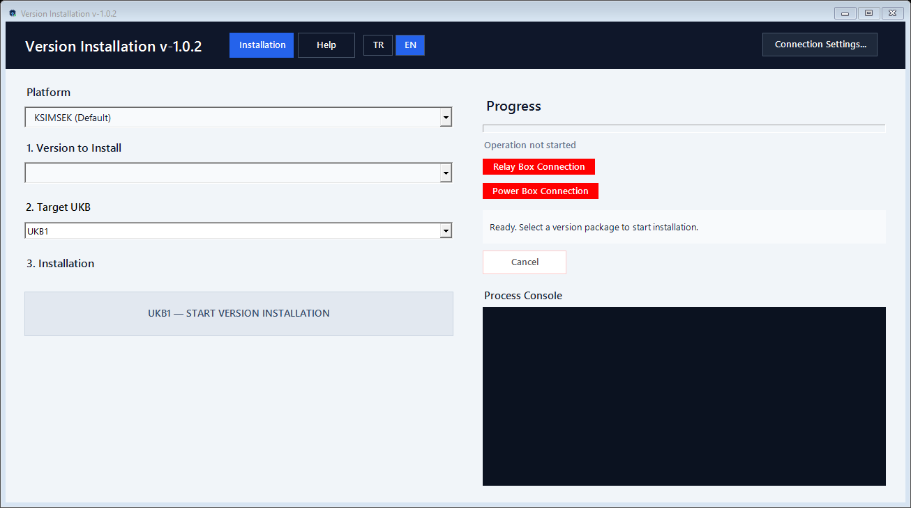
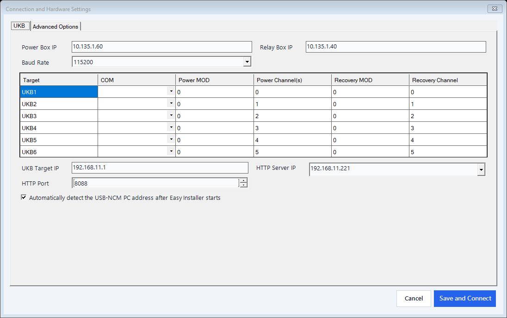
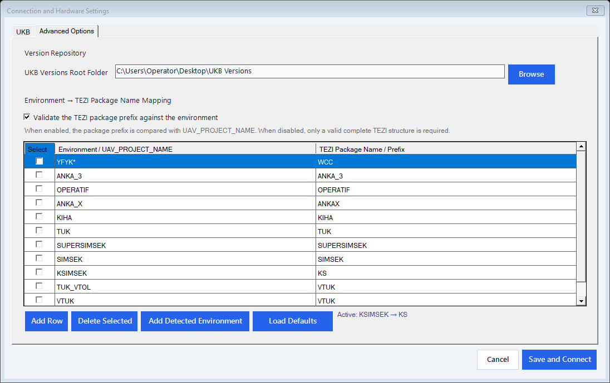

# Sürüm Yükleme

UKB uçuş kontrol bilgisayarlarına USB-NCM üzerinden TEZI sürüm paketi yükleyen Windows uygulamasıdır.

## Güncel sürüm

Güncel kararlı sürüm: **v1.0.3**

Sürümler arasındaki farklar için [SURUM_NOTLARI.md](SURUM_NOTLARI.md) dosyasına bakın.

## English interface

### Main installation screen

### UKB connection settings

### Advanced options

## Güvenlik

Depo özel tutulur. Saha bilgisayarına ait Settings.json, loglar, gerçek OFP paketleri ve kullanıcıya özel yapılandırmalar Git geçmişine alınmaz.

## Kaynak ve uygulama

- Kaynak kod: Kaynak Kod
- Çalıştırılabilir EXE: GitHub Releases bölümündeki ilgili sürüm varlığı
- Yerel saha uygulaması: Uygulama klasörü

## Doğrulama

Kaynak kod .NET 8 / WinForms hedeflidir. Regresyon testleri:

    dotnet run --project "Kaynak Kod/SurumYakma_Agdan/SurumYakma.Tests/SurumYakma.Tests.csproj" -c Release
